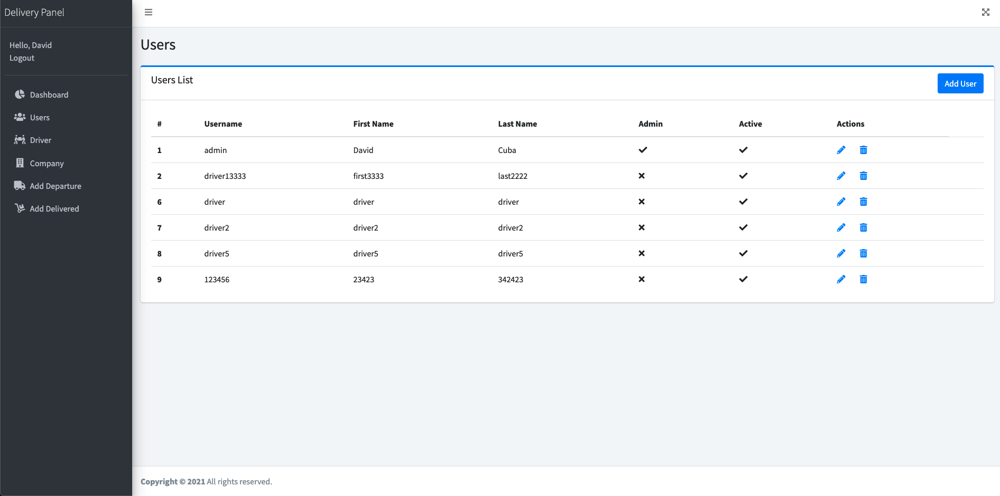

[![LinkedIn][linkedin-shield]][linkedin-url]


<!-- PROJECT LOGO -->
<br />
<p align="center">
  <a href="https://github.com/davidncuba/Django-CRUD-Ajax-Login">
    
  </a>

  <h3 align="center">Delivery System</h3>

  <p align="center">
    A CRUD project to inprouve my abilits in Django.
    <br />
    <a href="https://github.com/davidncuba/Django-CRUD-Ajax-Login"><strong>Explore the docs »</strong></a>
    <br />
    <br />
      <a href="https://github.com/davidncuba/Django-CRUD-Ajax-Login/issues">Report Bug</a>
    ·
    <a href="https://github.com/davidncuba/Django-CRUD-Ajax-Login/issues">Request Feature</a>
  </p>
</p>


<!-- TABLE OF CONTENTS -->
<details open="open">
  <summary><h2 style="display: inline-block">Table of Contents</h2></summary>
  <ol>
    <li>
      <a href="#about-the-project">About The Project</a>
      <ul>
        <li><a href="#built-with">Built With</a></li>
      </ul>
    </li>
    <li>
      <a href="#getting-started">Getting Started</a>
      <ul>
        <li><a href="#prerequisites">Prerequisites</a></li>
        <li><a href="#installation">Installation</a></li>
      </ul>
    </li>
    <li><a href="#usage">Usage</a></li>
  </ol>
</details>


<!-- ABOUT THE PROJECT -->
## About The Project



Thank you for read my project. This is my CRUD project in django to improve my knologe in programing language, and I'm feeling amazing. I spended around 12 hours to finish the first part of this project.

Here's why i did:
* First I receive this project to participate in an interview.
* Seccond I did to improve my skills
* Third because i love programing 

### Built With

* [Django 3.2.2](https://www.djangoproject.com/)
* [Bootstrap](https://getbootstrap.com/)
* [JQuery](https://jquery.com/)
* [Adminlte](https://adminlte.io/)


<!-- GETTING STARTED -->
## Getting Started

This is an example of how you may give instructions on setting up your project locally. To get a local copy up and running follow these simple example steps.

### Prerequisites

This is an example of how to list things you need to use the software and how to install them.
* Django
  ```sh
  python -m pip install Django==3.2.3

  ```

### Installation

1. Clone the repo
   ```
   git clone https://github.com/davidncuba/Django-CRUD-Ajax-Login.git
   ```


<!-- USAGE EXAMPLES -->
## Usage

To do the first access you must to creat a super admin.
```
python manage.py createsuperuser ```

After that you can do login in the system and create a new user (driver or admin) in the left bar.
 * Just admin have permission to create, edit and delete users/drivers.
 * Just admin can create, edit and detele a new company.
 * Just admin can do match driver x company.
 * Drivers and Admin can create a new Depature and receive the delivery.

<!-- ROADMAP -->
## Roadmap

See the [open issues](https://github.com/davidncuba/Django-CRUD-Ajax-Login/issues) for a list of proposed features (and known issues).


<!-- CONTACT -->
## Contact


Project Link: [https://github.com/davidncuba/Django-CRUD-Ajax-Login](https://github.com/davidncuba/Django-CRUD-Ajax-Login)


[linkedin-shield]: https://img.shields.io/badge/-LinkedIn-black.svg?style=for-the-badge&logo=linkedin&colorB=555
[linkedin-url]: https://linkedin.com/in/davidcuba
[product-screenshot]: images/screenshot.png
